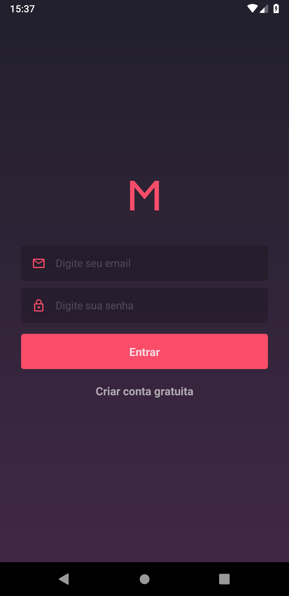
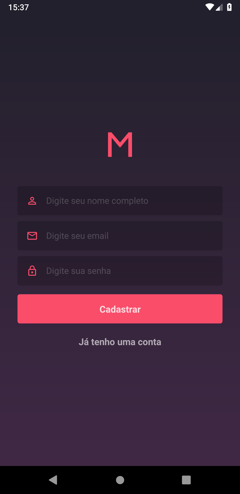
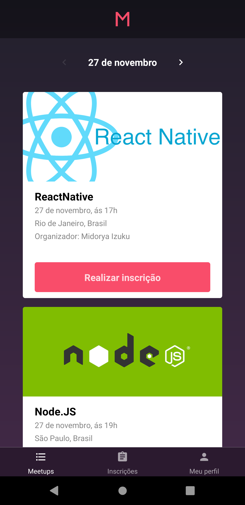
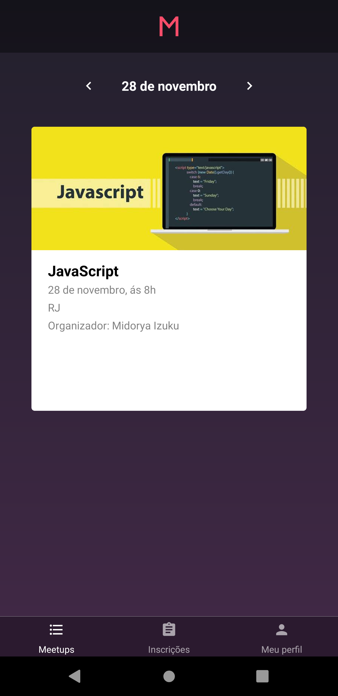
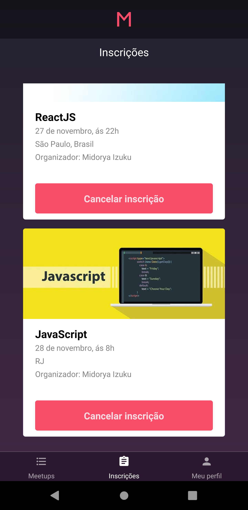
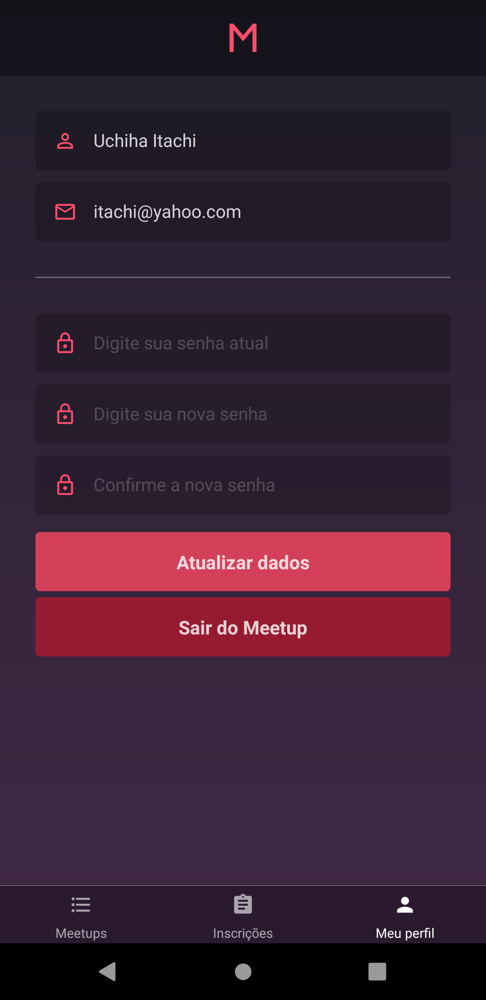

<h1>MeetUp Mobile</h1>
<h4>In this app the users can subscribe yourself in meetups per date and time.<h4> 
<h3<i>Technologies</i></h3> 
<ul>
  <li>ReactNative</li>
  <li>Redux - Redux - Redux - Saga</li>
<ul>  

  
  
  

  
  
  

