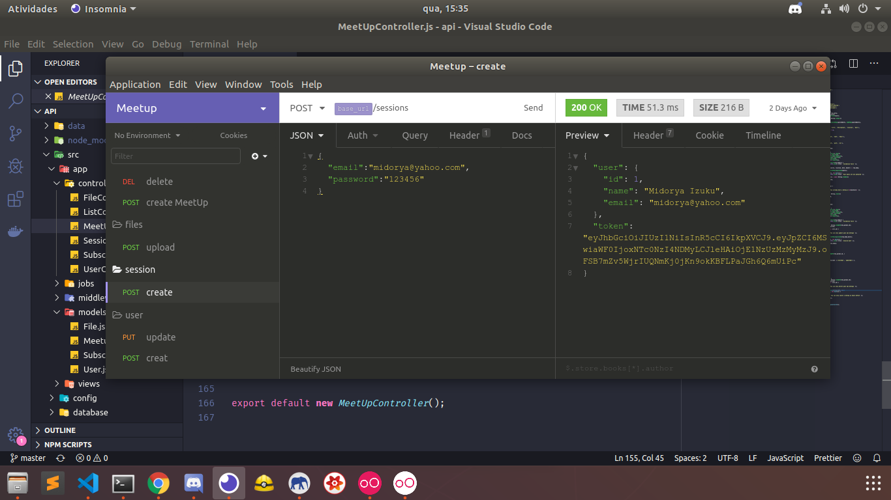

<h1>>> MeetUp <<</h1>

  
  

<h3>It's a project to bring together people with the same interest</h3>
<i>Instructions</i>
<ul>
  <li>First step: inside api's folder, run : "Docker-compose up"  to create containers</li>
  <li>Second step: inside api's folder,  run: " yarn sequelize db:migrate" to create the table in your database</li>
  <li>Third step: inside api's folder run: " yarn dev " to start the back-end</li>
  <li>Fourth step: inside web folder, run "yarn start" to start the front-end</li>
  <li> You can also use NPM</li>
</ul>

<h2>Backend: </h2>
Finished! 
<a href="api">Api Meetup</a>

  
  

<h2>Front-end</h2>
I worked with ReactJS, redux and redux-saga 
Finished !!
<a href="web">Web App</a>  

  
  

<h2>Mobile</h2>
I worked with ReactNative.
Finished !!
<a href="mobile">Mobile App</a>  

  
  

