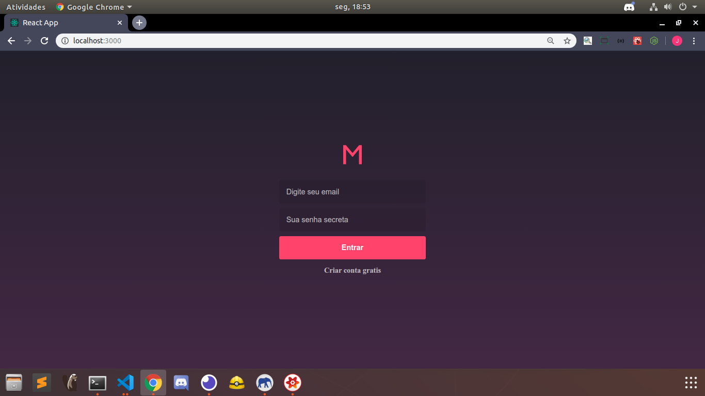
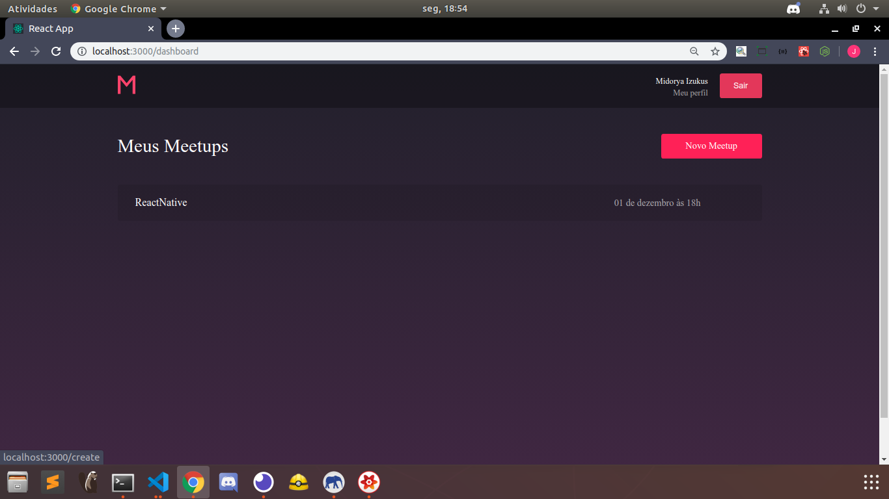
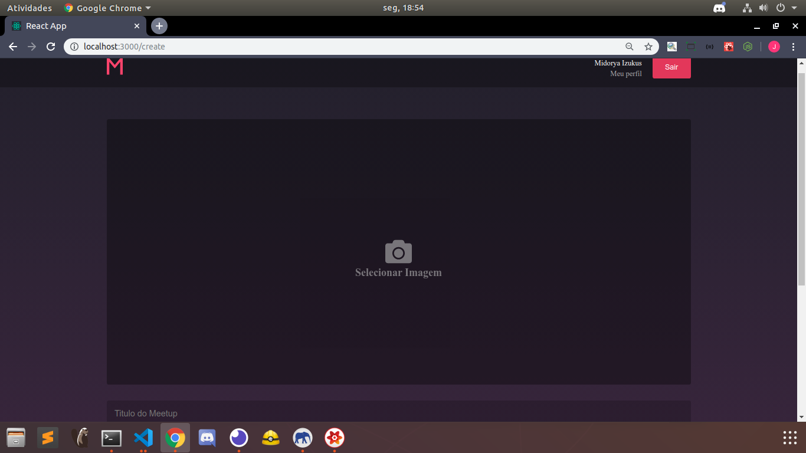
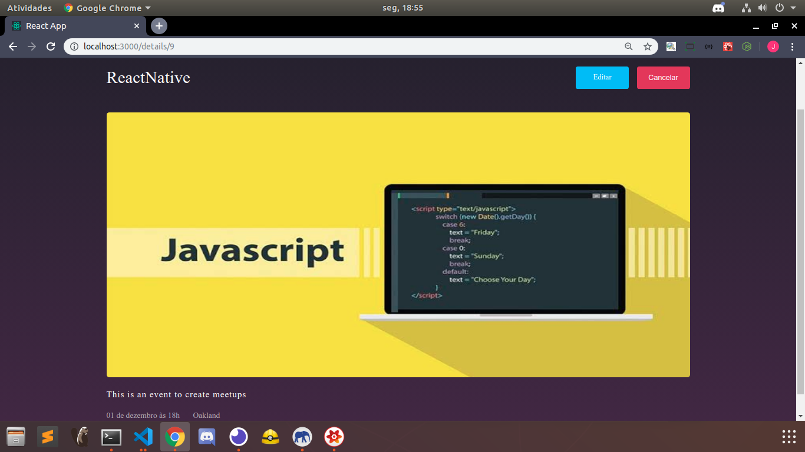
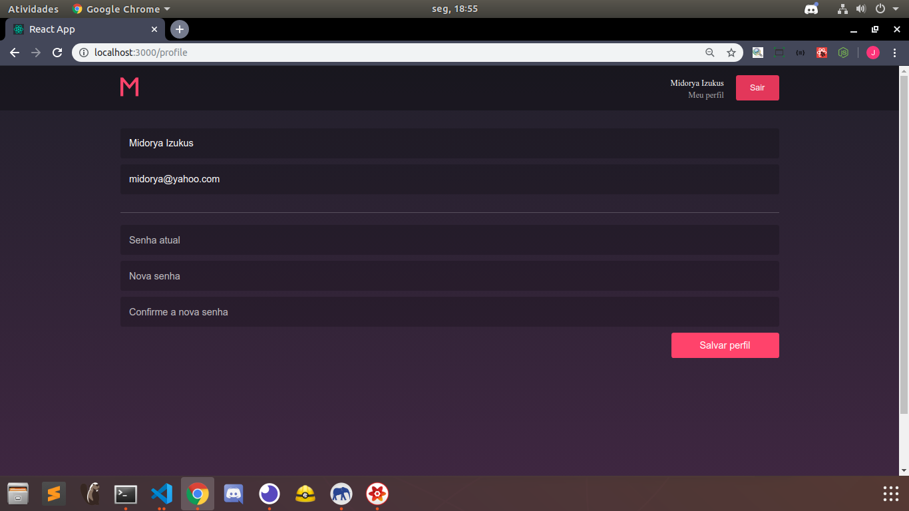

<h1> Meetup Web>
<h3>I built this application using react and react redux<h3>

<h4>Main Dependencies</h4>

In this application, the users can create meetups per region and date, they also can update e delete his own meetups, in the mobile version i'll make possible the meetup's subscriptions.
 
<ul>
  <li>Styled-components</li>
  <li>React toastify</li>
  <li>React icons</li>
  <li>react-router-dom</li>
  <li>React datepicker</li>
  <li>Rocketseat unform</li>
  <li>yup</li>
  <li>date fns</li>
<ul>

  
  
  

 

  
  
  

